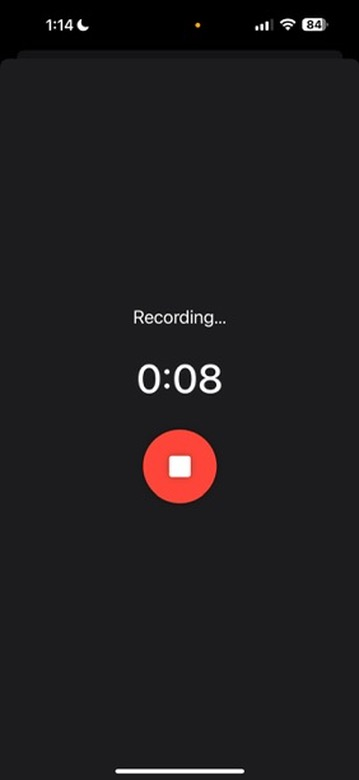
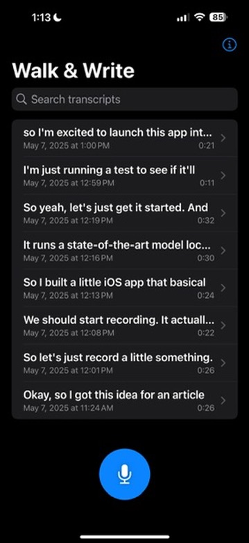
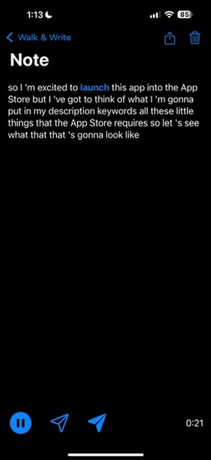
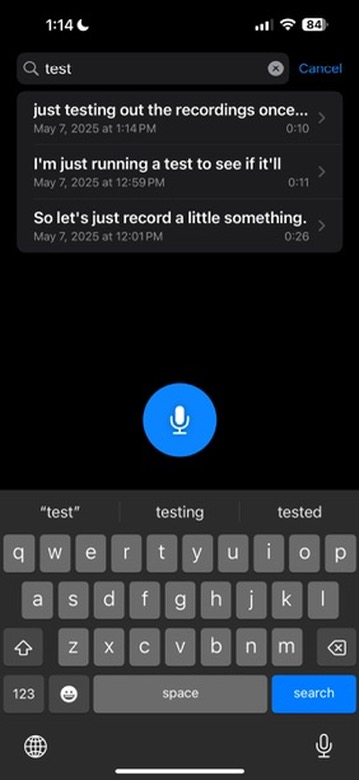
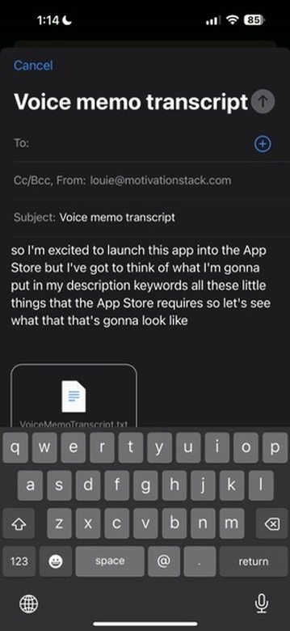

# WalkWrite - Voice Notes with On-Device AI

<p align="center">
  
</p>

<p align="center">
  <a href="https://apps.apple.com/us/app/walkwrite/id6745560717">
    
  </a>
</p>

WalkWrite is a voice note app that uses on-device Whisper 3.5 Turbo and Gwen 3 (but you could easily swap those models) to transcribe and enhance recordings on device. All processing happens locally on the device - no internet connection required, no data leaves the phone.

**This open-source version serves as a template and example for iOS developers who want to integrate local AI models (Whisper & LLMs) into their own apps.** The full app is available on the [App Store](https://apps.apple.com/us/app/walkwrite/id6745560717).

**Note**: This open-source version has no usage limits - all features are available without restrictions. The optional one time in-app purchase remains for users who wish to support development and updates.

## Features

- 🎙️ **High-quality voice recording** with real-time audio that is safely always saved on the users device.
- 🤖 **On-device transcription** using OpenAI's Whisper (large-v3-turbo model)
- ✨ **AI-powered enhancements** using Qwen-3 0.6B LLM:
  - Grammar and punctuation correction
  - Filler word removal
  - Automatic summarization
  - Key idea extraction
- 🔒 **Complete privacy** - all processing happens locally
- 📱 **Native iOS app** built with SwiftUI
- 🎯 **Offline first** - works offline on an airplane or in the woods

## Screenshots

<div style="display: flex; overflow-x: auto;">
  
  
  
  
  
</div>

## Requirements

- iOS 17.0+
- iPhone with A12 Bionic chip or newer (for Neural Engine)
- ~3GB free storage for models, App ships with the models but these could be easily made optional downloads and it could ship with smaller models
- Xcode 15.0+

## Building from Source

1. Clone the repository:
```bash
git clone https://github.com/yourusername/WalkWrite.git
cd WalkWrite
```

2. Install Git LFS and pull the model files:
```bash
brew install git-lfs
git lfs install
git lfs pull
```

3. Build the whisper.cpp framework:
```bash
./build-whisper-xcframework.sh
```

4. Configure your development environment:
```bash
./setup-developer.sh
```
This will set up your development team and bundle identifier.

5. Open the project in Xcode:
```bash
open WalkWrite.xcodeproj
```

6. Let Xcode resolve Swift Package dependencies (this may take a few minutes)

7. Build and run on your device (simulator not recommended due to model performance)

## Architecture

WalkWrite uses a Swift architecture with:

- **SwiftUI** for the UI layer
- **Swift Actors** for thread-safe model management
- **whisper.cpp** for speech-to-text transcription
- **MLX Swift** for running the Qwen LLM
- **Core ML** for optimized on-device inference

### Key Components

- `WhisperEngine.swift` - Manages whisper.cpp transcription
- `LLMEngine.swift` - Handles Qwen model inference via MLX
- `RecorderViewModel.swift` - Recording logic and audio processing
- `PostProcessor.swift` - Orchestrates the enhancement pipeline
- `NoteStore.swift` - Persistence and data management

## Models

The app includes two AI models:

1. **Whisper Large-v3-turbo** (Q5_0 quantized, ~574MB)
   - High-quality speech recognition
   - Optimized for mobile devices
   
2. **Qwen-3 0.6B** (~1.4GB)
   - Lightweight language model
   - Grammar correction and text enhancement

## Privacy

WalkWrite is designed with privacy as the top priority:

- ✅ All AI processing happens on-device
- ✅ No internet connection required for core features
- ✅ No telemetry or analytics
- ✅ Audio files stored locally in app sandbox
- ✅ Export only when explicitly requested by user

## Using as a Reference

This project is designed as a reference implementation for developers who want to:
- See how to integrate whisper.cpp in an iOS app
- Learn how to run local LLMs with MLX Swift
- Build privacy-focused AI features without servers

Feel free to use any code from this project in your own apps!

## License

This project is licensed under the MIT License - see the [LICENSE](LICENSE) file for details.

## Use as a Template

This project is designed to help iOS developers learn how to:

- Integrate whisper.cpp for on-device speech recognition
- Run small LLMs locally using MLX Swift
- Manage memory efficiently when running multiple AI models
- Build privacy-first AI features without server dependencies
- Handle background processing for long-running AI tasks

Feel free to use this code as a starting point for your own AI-powered iOS apps!

## Acknowledgments

- [whisper.cpp](https://github.com/ggerganov/whisper.cpp) by Georgi Gerganov
- [MLX Swift](https://github.com/ml-explore/mlx-swift) by Apple
- [Qwen](https://github.com/QwenLM/Qwen) by Alibaba Cloud
- Not fully "vibe coded" but AI did help build this, so it deserves acknowledgment

## Author

Created by [Louie Bacaj](https://louiebacaj.com/)
